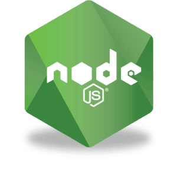

# 

## <span style="color:#99aab5"> <span style="color:;"> &#9998; </span>Екзаменаційна робота на тему: &laquo;node.js&raquo; 
 
 студентів Комп'ютерної Академії STEP</span>

## &#9879; Особливості

- Шаблон проектування [MVC](https://uk.wikipedia.org/wiki/Модель-вид-контролер)

 

- використовується система управління реляційними базами даних [MariaDB](https://mariadb.org)
- працює на платформі [Node.js](https://nodejs.org/uk/)
- в якості проміжного обробника для управління сервером і маршрутами використовується фреймворк [Express.js](https://expressjs.com/ru/) 
- для роботи з базами даних використовується ORM-бібліотека [Sequelize](https://sequelize.org) 
- міддлвер аутентифікації [Passport](http://www.passportjs.org)

## :hammer_and_wrench: Щоб запустити проєкт

- Встановіть [NodeJS](https://nodejs.org/en/) (якщо потрібно)
- Клонуйте репозиторій за допомогою [Git ](https://git-scm.com/downloads): `git clone https://github.com/RivneITStep/BootShop.git`
- перейдіть в скачану папку з проєктом: `cd BootShop`
- скачайте необхідні залежності: `npm install`
- щоб почати роботу, введіть команду: `npm start` (режим розробки)

Якщо ви все зробили правильно, у вас в браузері повинен відкритися
`http://localhost:8000/`

## :open_file_folder: Файлова структура

```
BootShop
├── controller
├── helper
├── model
├── routes
├── static
├── views
│   ├── layouts
│   ├── pages
├── app.js
├── package.json
└── .gitignore
```

- Корінь папки:
  - `app.js` — вхідний файл
  - `package.json` — список залежностей
  - `.gitignore` – заборона на відстеження файлів Git'ом
- Папка `controller` - отримує введення користувача та здійснює дзвінки до модельних об'єктів та подання для виконання відповідних дій.
- Папка `helper` - допоміжні функції
- Папка `model` - дані, та управління даними програми
- Папка `routes` - визначає, як додаток відповідає на клієнтський запит до конкретної адреси, яким є URI (або шлях), і певного методу запиту HTTP (GET, POST і т.д.).
- Папка `static` - статичні файли
- Папка `views` - переводить дані з моделі у форму, що підходить для користувальницького інтерфейсу.

### Template

Скачати шаблон сайту можна [`ТУТ`](https://drive.google.com/file/d/1lFp1yxijDRRLpY1einSxZrs96saOaaTK/view?usp=sharing)
